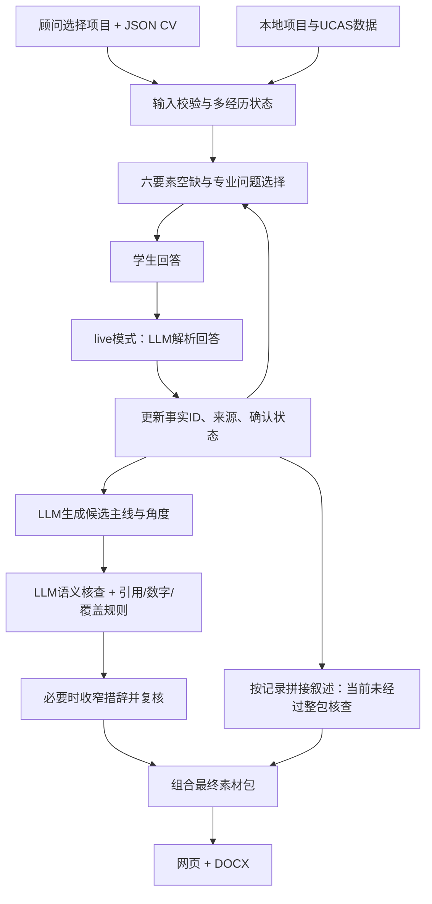

# 产品说明：UK CS 头脑风暴顾问工作台

版本：2026-10-04研究原型。代码入口：`counselor/server.py`；质量证据：[真实输出评分](../eval/OUTPUT_EVALUATION_REPORT.md)。

## Persona与任务

主要用户是教育咨询机构的英国本科CS升学顾问。顾问拿到学生多段经历的简历，在访谈中补充本人贡献、知识、方法、困难、反思和结果，整理供文书老师审阅的素材。学生是回答与确认经历的参与者。系统终点是头脑风暴素材文档；后续学业规划、任务排程与择校收敛不在本次范围。

## 输入

本次产品与评测使用**结构化JSON CV**，不需要额外格式。完整可用示例见[data/sample_cv.json](../data/sample_cv.json)。核心结构：

```json
{"student":{"id":"synthetic_01","label":"虚构学生","subjects":[{"name":"Mathematics","predicted":"A*"}],"experiences":[{"title":"课表可视化项目","role":"清理数据并测试原型","skills":["Python"],"outputs":["社团展示原型"],"type":"project"}]}}
```

顾问选择本地收录的一个或多个项目，再逐轮输入学生回答。`type`可为academic/project/competition/reading/holistic；系统保留事实ID、来源和确认状态。CV里记载过不自动等于访谈已确认，访谈陈述也不等于外部核实。现存其他格式入口是兼容能力，不是本次测试的必要输入。

## 输出

网页与Word素材包包含候选申请主线、多经历素材卡、六要素记录、专业角度、素材总结、三问映射、来源、论点审计和待追问问题。可跳过问题、提前结束，输出不完整素材。它不是最终个人陈述、录取预测或无人审阅的建议。

例如“同设备、千条记录、各三次查询计时5秒到3秒”最多支持相应条件下的计时改善；“开发周期不足所以放弃复杂方案”支持可行性取舍，不自动支持算法性能优化。系统尝试核查这种措辞关系，但当前仍会误放和误拦。

## 输入到输出的架构



demo模式使用本地模板，展示流程，不调用模型。问题选择由状态与模板控制；live模式的外部模型参与回答解析、候选生成、语义核查及可选复核。模型供应商为OpenRouter，实测模型为`openai/gpt-4.1-mini`。同模型的另一核查调用不等于独立可靠的裁判。

**Guard边界：目前主要核查候选主线与角度，没有覆盖最终素材包所有文字。** 规则核对连续论点片段能否重构原句、事实ID与经历归属、确认状态、逐字引文及数字；语义支持关系由模型判断。组合阶段的叙述仍可能保留未确认或已被纠正的CV内容，并把错误解析发布为事实。模型核查通过不能代表整份文档安全。

## 目标与已达到值

20个合成候选、两组40份输出；同一AI作者编写参考与评分，没有独立held-out或人工复核。

| 指标 | 目标/用途 | 基线 | 完整组 |
| --- | --- | --- | --- |
| 无依据论点率 | 原提案低于10% | 137/671=20.42% | 103/594=17.34%，未达标 |
| 缺口覆盖率 | 与错误率共同解释效果；未预设数值门槛 | 23/28=82.14% | 23/28=82.14% |
| 有用事实机会保留 | 检查过度删除 | 56/56=100% | 56/56=100% |
| 交付失败 | 记录可运行性 | 0/20 | 0/20 |
| 每成功案例API费用USD | 实际调用统计，无预设单例门槛 | 0.00273558 | 0.00615790 |

基线共享schema、解析与候选，评测衡量guard的增量作用；不是原提案完全无schema的prompt-only实验。覆盖与保留的高分主要反映原话保留，不能证明专业建议质量。完整组剩余103条错误中85条来自共同叙述。小样本没有显著性或真实顾问效率证据。主运行实际费用USD0.123158，含连接与开发预跑USD0.1839696；没有统计人工时间或Codex费用。

## 代码模块地图

| 文件/模块 | 职责 |
| --- | --- |
| `web/`、`counselor/server.py` | 网页、会话API、执行访谈/核查/导出路径 |
| `counselor/config.py`、`check_llm.py` | 供应商配置与安全连接检查 |
| `counselor/intake.py`、`cv.py` | 输入归一化、兼容文档读取及原始文本脱敏 |
| `counselor/workflow.py` | 多经历六要素、问答状态、来源、最终素材组织 |
| `counselor/llm.py` | 模型请求、回答解析、生成及语义核查 |
| `counselor/claim_check.py` | 论点片段、引用归属、确认状态、数字与收窄准入 |
| `counselor/document.py` | 将同一结果导出DOCX |
| `counselor/data.py`、`data/` | 本地项目、UCAS与虚构样例 |
| `counselor/domain.py` | 较早单经历兼容路径 |
| `eval/paired_eval.py`、`score_paired.py` | 配对运行、冻结与计费；汇总外部填写的判断 |
| `tests/` | 状态、API、文档、配置与评测协议测试 |

## 使用与数据边界

仅本机127.0.0.1服务；会话在内存，重启丢失，没有登录、持久档案或个案删除界面。live模式会把回答及结构化材料发给供应商：不能宣称仅本地处理，JSON输入也不能假定已全面脱敏。提交与演示用虚构数据，密钥不提交。本地11个项目条目与招生要求尚待核实；少量数学/科学规则不构成完整资格判断。中文DOCX结构已测，最终字体排版需在Word查看。

复现步骤见[复现说明](REPRODUCIBILITY.md)；提案差异和第二版决策见[核对记录](statement_alignment.md)。
